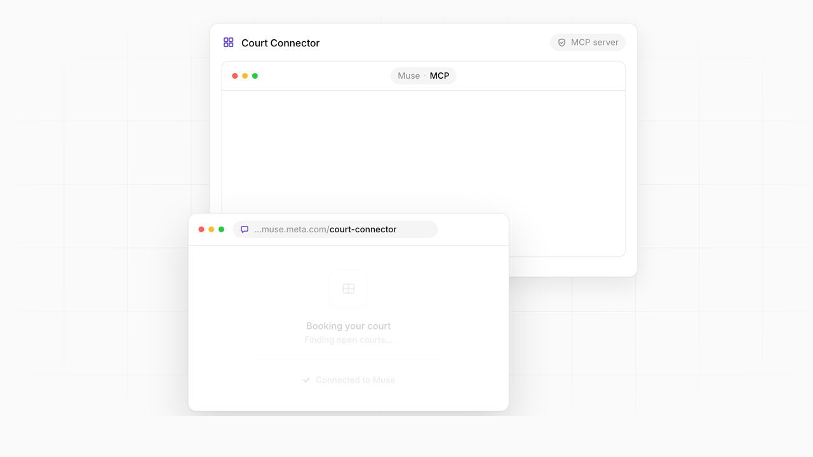

# Court Connector

Let players book courts at your venue by asking Meta Muse.



> "Any indoor court tomorrow around 6pm?" → Muse finds open courts, shows the price, and books one after the player confirms.

Court Connector is an MCP server template for court booking on [Meta Muse](https://muse.ai). You clone it, describe your venue in one YAML file, deploy it to Vercel, and submit it to Muse's connector directory. It runs on the free tiers of Supabase and Vercel.

This repository holds the documentation and demo. The source code is a paid template: **[Get Court Connector →](https://spacetimebender.gumroad.com/l/xdrqen)** · Website: [court-connector.framer.website](https://court-connector.framer.website)

## Try it live

Add this endpoint to Claude or any MCP client. No login needed. It runs on sample data and resets every 30 minutes:

```
https://court-connector-demo.vercel.app/api/mcp
```

Claude Code: `claude mcp add --transport http court-demo https://court-connector-demo.vercel.app/api/mcp`

## What players can say

- "Show me open courts tomorrow evening."
- "Book Court 3 at 6pm."
- "Move my booking to Saturday."
- "Cancel my reservation."
- "Put me on the waitlist for Friday 7–9pm and text me if something opens."

## Tools

Nine MCP tools, each labelled with the permission class Muse's review expects.

| Tool | Muse class | What it does |
|---|---|---|
| `check_availability` | Read | Open courts by date, time window, surface and indoor/outdoor. |
| `get_quote` | Write | Locks the price for one slot for 5 minutes, signed with HMAC so it can't be changed. |
| `create_booking` | Sensitive write | Turns a quote into a confirmed booking. Muse asks the player to confirm every time. |
| `modify_booking` | Write | Moves a booking to another slot in one step. |
| `cancel_booking` | Write | Cancels and frees the slot for the next player. |
| `get_booking` | Read | Looks up a booking and its status (confirmed or cancelled). |
| `join_waitlist` | Write | Waits for a full time window; optional email or SMS alert with consent. |
| `leave_waitlist` | Write | Leaves the waitlist and releases any held slot. |
| `get_waitlist_status` | Read | Shows the player's waitlist entries and any slot held for them. |

Full reference: [docs/tools.md](docs/tools.md)

## Built for Muse review

- **Confirm before booking.** The player sees court, time and price, then confirms. Bookings are Sensitive writes, so Muse asks every time.
- **No double bookings.** Idempotency keys make retries safe, and booking is a single database transaction, so two players can never get the same slot.
- **Price can't drift.** Quotes are HMAC-signed and expire after 5 minutes.
- **Reviewer test account.** A separate API key sees an isolated copy of your venue, so Meta's reviewers never touch real bookings. One command resets it.
- **Submission sheet.** `npm run submission` writes the endpoint, auth, tool table, side effects, errors and test steps Muse's form asks for.
- **Tests.** Every requirement in Meta's connector guidelines has a test, and `npm run test:report` produces a report to attach to your submission.

How it works: [docs/how-it-works.md](docs/how-it-works.md)

## Waitlist with alerts

When a full slot frees up, it is held for the first matching player for 15 minutes. They hear about it by email (Resend), SMS (Twilio) or the next time they talk to Muse, and say "book it". If they don't, the hold passes to the next player.

## Your venue in one file

```yaml
venue:
  name: "Ace Pickleball Club"
  timezone: "America/Chicago"
courts:
  - name: "Court 1"
    surface_type: "hard"
    indoor: false
operating_hours:
  open_time: "06:00"
  close_time: "22:00"
pricing:
  base_price_cents: 2500
  peak_price_cents: 4000
```

Full example: [docs/venue-config.example.yaml](docs/venue-config.example.yaml)

## Stack

TypeScript MCP server (`@modelcontextprotocol/sdk`, streamable HTTP) · Supabase (Postgres with row-level security) · Vercel. Bring-your-own inventory: the booking logic runs against a backend interface, with Supabase built in and a CourtReserve adapter in preview.

## Get it

Court Connector is a one-time purchase that includes the full source, tests and deploy config. **[Get the template →](https://spacetimebender.gumroad.com/l/xdrqen)**

---

Documentation © 2026 Court Connector. All rights reserved. Meta and Muse are trademarks of Meta Platforms, Inc. Court Connector is not affiliated with Meta.
